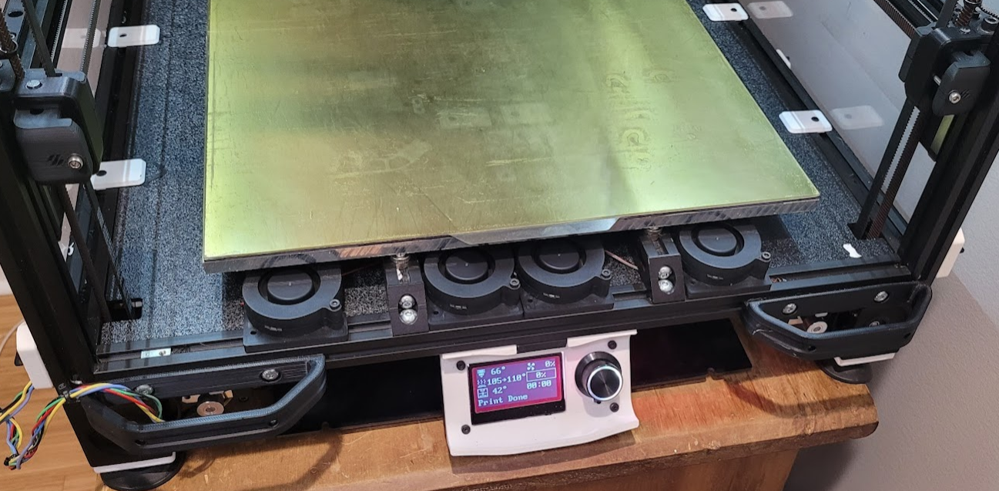

## <b>FAQ</b>

#### How much difference does it make?
My chamber now reaches about 60-66C with a quad fan configuration, whereas it only reached roughly 48-50C previously. Chamber temp is also reached more quickly.

#### Can I push it further?

Technically your bed heater is not being run at full power with the default configs, however I <i>do not recommend pushing it.</i>

Since you can't control max power at runtime, your bed will run at too high of a power while heating, risking warping your bed. 

<i>I also do not recommend tinkering with your verify_heater (thermal runaway protection) settings.</i>

#### What power should I run my bed heater at?

Recommended max_power is 0.4 watts per cm2.

For example, for a 300 mm^2 bed:\
30 cm * 30 cm = 900 cm2\
900 cm2 * 0.4 Watts = 360 Watts.

If you have a 750 watt heater, that's 48% power, or 0.48 max_power.

#### Do I need to PID tune my bed again?

I did not find it necessary. Bed heaters do not seem to be terribly sensitive to this. 

#### My bed temperature dips when the fans kick on fully, is this normal?

Yes, this is normal. It should recover within 60 seconds. If not, then your fan speeds are too high.

#### What brand fans should I use?

I just used generic multi-pack fans. There is no need for anything fancy here.

#### Should I use single, dual or triple/quad fans?

Triple/quad fans is more for <i>even</i> airflow than <i>raw</i> airflow. In fact you will likely not be able to run them at 100% without outrunning your bed heater. 

I personally prefer triple/quad fans to avoid any possibility of "tacoing" my bed due to uneven temperatures. 

Triple fans is probably the sweet spot. I had the spare fans sitting around so I went for quad.

#### Is "dual control" necessary?

Almost certainly not. I originally set it up that way because it was easier to wire in my particular case. But since I had had it set up that way, I took advantage of it to keep my inner fans running a bit lower since the airflow is more channeled.

Triple fans with "single" control is probably the best balance.

#### I insist on running quad fans at 100%, why am I having a bad time?

No. Stop it. Bad.

## <b>Macros and Usage</b>

See <b>bedfans.cfg</b> or <b>bedfans-dualcontrol.cfg</b>* for klipper macros.

<b>1)</b> Place the .cfg file in the same directory as your printer.cfg file. 

<b>2)</b> Add `[include bedfans.cfg]` to your printer.cfg.

<b>3)</b> Change `pin` for your fans in the second section. This is intentionally left blank so that it will error if you don't fill it in.

<b>4)</b> Configure the options in the first section:

* `variable_threshold` sets the target bed temperature at which your bed fans will activate.
* `variable_slow` sets the "slow" fan speed for when the bed is heating to the target temp.
* `variable_fast` sets the "fast" fan speed for when the bed is at temperature.
    * This may have to be lower than 100% fan speed, especially with quad fans.
    * If you get <i>"Heater heater_bed not heating at expected rate"</i> errors, then you have set this too high. 

The macros will intercept bed heating commands, so you do <i>not</i> need to add anything to your other macros. 

\* <i>Optionally allows for setting inner and outer fan speeds separately, for a quad fan configuration. I like to set my inner fans to be run slightly slower to try and keep the airflow somewhat even.</i>

## <b>5015 Fan Mount</b>

Bill of materials (per fan):
- 1x 5015 fan
- 1x M3x25
- 1x M3x20
- 1x M3 heat set insert
- 1x M3x8 or M3x10 <i>(optional, I only mount with one screw)</i>

  

#### Photos

<i>(looks a bit tight since CAD is for a 250mm)</i>
  
  

